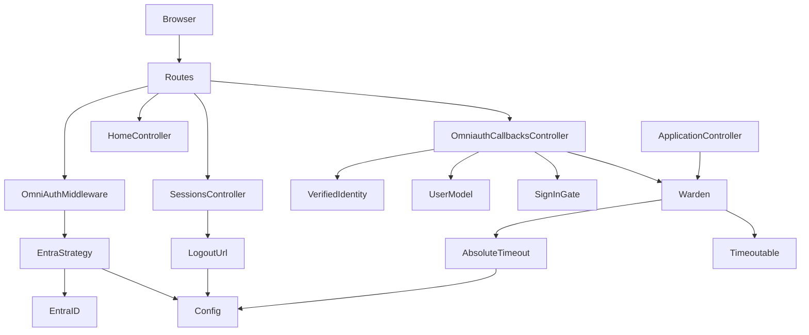
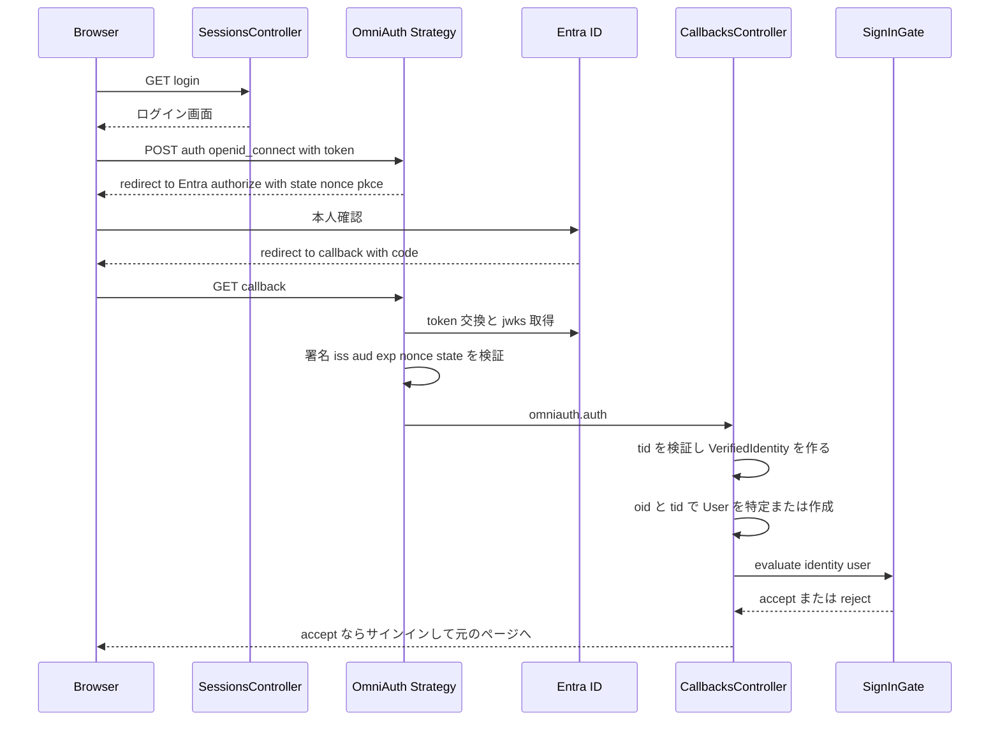
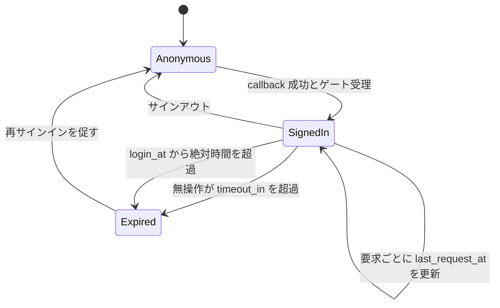

# Design Document

## Overview
本設計は、Entra ID（単一テナント）の OIDC によるサインイン、セッション管理、サインアウトをアプリに追加する。認証は Devise（`omniauthable` + `timeoutable`）に、失敗処理を強化した omniauth_openid_connect の strategy を登録して実現する。アプリ独自のパスワードは持たない。

**Purpose**: 組織の Entra ID アカウントでサインインでき、アプリの全ページを既定で保護する認証基盤を提供する。
**Users**: 組織の利用者（サインイン、サインアウト）、運用者（設定、Entra ID 側の登録）、開発チーム（`current_user` の利用と、`entra-authorization` によるサインイン可否ゲートの追加）。
**Impact**: `rails new` 直後の雛形に、`User` モデル、認証関連のルート・コントローラ、`lib/entra_auth/` を追加する。既存の機能を変更するのは `ApplicationController`、ルーティング、レイアウトのみ。

### Goals
- Entra ID の OIDC（Authorization Code Flow + PKCE）で、単一テナントのユーザーがサインインできる
- `oid` + `tid` でユーザーを一意に特定し、`User` と対応付ける
- 無操作タイムアウトと絶対時間上限でセッションを失効させる
- サインアウト時に Entra ID 側のセッションも終了させる
- 後続の認可処理がサインインの可否を判断できる拡張点を提供する

### Non-Goals
- ロール・グループの解釈、権限判定、ロール起因のログイン拒否（`entra-authorization`）
- Front-channel / Back-channel Logout、Remember me、Access token を使った API 呼び出し
- Entra ID 以外の認証手段、Microsoft Graph の呼び出し
- DB の選定（SQLite / PostgreSQL）。本設計は両方で動く DDL に限定する

## Boundary Commitments

### This Spec Owns
- Devise / OmniAuth の導入と設定、Entra ID 用 strategy（`EntraAuth::Strategy`）
- サインインの開始・callback・失敗のハンドリング、認証結果の検証（`tid` を含む）
- `User` モデルと `(tid, oid)` による特定・作成
- サインイン可否ゲートの契約 `EntraAuth::SignInGate`（拡張点）と、`VerifiedIdentity` の形
- 認証必須化（`ApplicationController`）、ログイン画面、サインアウト後の画面、最小のトップページ
- セッション寿命（無操作・絶対時間）とサインアウト（Entra ID 側の終了を含む）
- Entra ID との接続設定（`EntraAuth::Config`）と、設定手順書 `docs/entra_id_setup.md`

### Out of Boundary
- ロール・グループ・権限（`users` テーブルへのロール列、Ability、クレームの解釈）
- ゲートの中身（ロール空・overage の判定と文言）。ここでは契約と、拒否時の表示の枠組みだけを持つ
- 業務ドメインの画面・モデル
- Entra ID テナント側の設定作業そのもの（手順書に書くだけ）

### Allowed Dependencies
- Rails 7.2 標準、Devise 5.0.x、omniauth 2.1.x、omniauth_openid_connect 0.8.x、omniauth-rails_csrf_protection 2.0.x
- Entra ID の OIDC エンドポイント（discovery、authorize、token、jwks、logout）
- 依存の向き: `lib/entra_auth`（Config / VerifiedIdentity / SignInGate / AbsoluteTimeout / LogoutUrl / Strategy）← `config/initializers` ← `app/models` / `app/controllers` ← `app/views`。`lib/entra_auth` は `app/` のクラスを参照しない（`SignInGate` が受け取る `user` は型を固定せず、必要な属性だけを使う）
- `entra-authorization` は `EntraAuth::SignInGate` にだけ依存してよい。本 spec の他の内部（strategy、コントローラ）には依存しない

### Revalidation Triggers
- `SignInGate` の契約（`VerifiedIdentity` の項目、`Decision` の形、呼び出しタイミング）の変更
- `User` の識別子（`tid` / `oid`）やテーブル名の変更
- サインイン失敗時の表示の仕組み（flash のキー、遷移先）の変更
- セッションの仕組みの変更（Cookie セッション以外への変更、`warden.session` の使い方）
- 認証必須化の既定（保護対象 / 公開ページの指定方法）の変更
- 必要な Entra ID 側の設定（スコープ、オプションクレーム）の変更

## Architecture

### Architecture Pattern & Boundary Map


**Architecture Integration**:
- Selected pattern: Rails 標準の MVC に、Devise / Warden（セッション管理）と OmniAuth（Rack ミドルウェア）を重ねる。認証固有のロジックは `lib/entra_auth/` の小さな部品に集める
- Domain/feature boundaries: 「検証と特定」（Strategy、VerifiedIdentity、User）、「可否の判断」（SignInGate。中身は下流）、「セッションの寿命」（Timeoutable、AbsoluteTimeout）、「終了」（LogoutUrl、SessionsController）に分ける
- Existing patterns preserved: 認証必須化は `ApplicationController` の `before_action`、公開ページは明示的な skip（`structure.md`）。外部設定は initializer で読み込み、値は環境変数または credentials（`structure.md`）
- New components rationale: gem の標準挙動だけでは、検証エラーが 500 になる、logout が Devise の経路に乗らない、絶対時間がない、の 3 点を満たせないため
- Steering compliance: コントローラは薄く保ち、ロジックは PORO へ。秘密情報はコードに書かない。テストは `test/` に `app/` と同じ構造で置く

### Technology Stack

| Layer | Choice / Version | Role in Feature | Notes |
|-------|------------------|-----------------|-------|
| Backend / Services | Devise 5.0.x（`>= 5.0.4`） | セッション管理（Warden）、`omniauthable`、`timeoutable` | 5.0.4 でオープンリダイレクトの修正を含む |
| Backend / Services | omniauth 2.1.x、omniauth_openid_connect `~> 0.8.0` | OIDC RP。discovery、PKCE、state / nonce、ID token 検証 | 最終リリース 2024-07。バージョンを固定する |
| Backend / Services | omniauth-rails_csrf_protection 2.0.x | サインイン開始を POST + 認証トークンに限定 | 全て MIT |
| Frontend | Hotwire（既存）、ERB | ログイン画面、`button_to`（`data: { turbo: false }`） | 新規の JS は不要 |
| Data / Storage | SQLite / PostgreSQL（既存） | `users` テーブル | どちらでも動く DDL にする |
| Test | Minitest（既存）、webmock（テスト用に追加） | Strategy 単体テストで discovery / jwks / token の各エンドポイントをスタブする | テスト用 RSA 鍵で署名した ID token を使う |
| Infrastructure / Runtime | Ruby 4.0 / Rails 7.2 | 環境変数または credentials から設定を読む | Cookie セッションのみ使う |

## File Structure Plan

### Directory Structure
```
lib/
├── entra_auth.rb                     # lib/entra_auth 配下を明示的に require する入口（Zeitwerk 管理外）
└── entra_auth/
    ├── config.rb                     # 環境変数 / credentials から設定を読み、検証する
    ├── strategy.rb                   # OmniAuth OpenIDConnect を継承。例外を fail! に集約
    ├── verified_identity.rb          # 検証済みクレームの値オブジェクトと tid 検証
    ├── sign_in_gate.rb               # 下流が登録するサインイン可否ゲートの契約と評価
    ├── absolute_timeout.rb           # Warden after_set_user フック（絶対時間の失効）
    └── logout_url.rb                 # Entra ID の logout URL を組み立てる
app/
├── models/user.rb                    # oid / tid で特定される利用者。omniauthable, timeoutable
├── controllers/
│   ├── application_controller.rb     # (変更) authenticate_user! を既定で適用
│   ├── sessions_controller.rb        # ログイン画面、サインアウト、サインアウト後の画面
│   ├── home_controller.rb            # 保護対象の最小のトップページ
│   └── users/omniauth_callbacks_controller.rb  # callback と failure
└── views/
    ├── sessions/new.html.erb         # ログイン画面（button_to POST）
    ├── sessions/signed_out.html.erb  # サインアウト後の画面（公開）
    ├── sessions/unavailable.html.erb # 設定不備時の画面（内部情報なし）
    ├── home/index.html.erb           # トップページ
    └── layouts/application.html.erb  # (変更) flash 表示、サインアウトのボタン
config/
├── initializers/devise.rb            # Devise 設定と OmniAuth プロバイダ登録（strategy_class）
├── initializers/entra_auth.rb        # require "entra_auth"、Config 検証、AbsoluteTimeout 導入
├── initializers/filter_parameter_logging.rb  # (変更) 認可コード・state をフィルタ対象に追加
├── application.rb                    # (変更) autoload_lib の ignore に entra_auth を追加
├── routes.rb                         # (変更) devise_for、login / logout / signed_out、root
└── locales/entra_authentication.{ja,en}.yml   # 失効・失敗の文言（devise.failure.* を含む）
db/migrate/YYYYMMDDHHMMSS_create_users.rb      # users テーブル
docs/entra_id_setup.md                # Entra ID 側の設定と実機確認の手順（要件 8.5）
test/                                 # app / lib の構造をミラーリング（Testing Strategy 参照）
├── support/oidc_provider_stub.rb     # テスト用 RSA 鍵、ID token の署名、discovery / jwks / token の WebMock スタブ
└── lib/entra_auth/strategy_test.rb   # Strategy を Rack レベルで通す単体テスト（test_mode を使わない）
```

### Modified Files
- `Gemfile` / `Gemfile.lock` — devise、omniauth_openid_connect（`~> 0.8.0`）、omniauth-rails_csrf_protection を追加。`:test` グループに webmock を追加
- `config/application.rb` — `config.autoload_lib(ignore: %w[assets tasks entra_auth])`
- `app/controllers/application_controller.rb` — `before_action :authenticate_user!`
- `config/routes.rb`、`app/views/layouts/application.html.erb` — 上記のとおり
- `.kiro/steering/structure.md`（実装後のフォローアップ）— `lib/entra_auth/` は Zeitwerk の管理外で、`config/initializers/entra_auth.rb` から明示的に `require` する、という例外を追記する

## System Flows

### サインイン

検証エラーは Strategy が `fail!` に集約し、`failure` アクションがログイン画面へ戻す。ゲートが拒否した場合は、セッションを開始せず理由を表示してログイン画面へ戻す。

### セッションの状態

絶対時間の起点は再サインインごとに `login_at` を更新して切り替える。失効は次の要求で検知する。

## Requirements Traceability

| Requirement | Summary | Components | Interfaces | Flows |
|-------------|---------|------------|------------|-------|
| 1.1 | サインイン開始で Entra ID へ遷移 | SessionsController, Strategy | POST auth openid_connect | サインイン |
| 1.2 | 検証後にセッション開始、元のページへ | OmniauthCallbacksController | callback | サインイン |
| 1.3 | 開始を POST 送信に限定 | omniauth-rails_csrf_protection, sessions/new | button_to POST | サインイン |
| 1.4 | 独自パスワードなし | User（database_authenticatable なし） | — | — |
| 1.5 | サインイン済みなら再要求しない | Warden, ApplicationController | authenticate_user! | セッションの状態 |
| 2.1 | テナント・宛先の検証 | Strategy, VerifiedIdentity | issuer, aud, tid | サインイン |
| 2.2 | 署名・有効期限の検証 | Strategy（gem の verify） | ID token 検証 | サインイン |
| 2.3 | 同じブラウザの要求との対応 | Strategy（state, nonce, PKCE） | state, nonce | サインイン |
| 2.4 | 検証失敗ではセッションを開始しない | Strategy, OmniauthCallbacksController#failure | fail! | サインイン |
| 2.5 | 他テナントは拒否 | VerifiedIdentity, Strategy | tid 検証, issuer | サインイン |
| 2.6 | Access token を保持・利用しない | OmniauthCallbacksController | auth.credentials を参照しない | サインイン |
| 3.1 | oid と tid で特定 | User, VerifiedIdentity | User.from_identity | サインイン |
| 3.2 | 未存在なら作成 | User | User.from_identity | サインイン |
| 3.3 | 既存なら新規作成しない | User | User.from_identity | サインイン |
| 3.4 | 可変属性で特定しない | User（一意制約は tid, oid のみ） | — | — |
| 3.5 | 同じ組を複数作らない | users の一意インデックス | unique index | — |
| 3.6 | 同時サインインでも重複しない | User | RecordNotUnique の再取得 | — |
| 4.1 | キャンセル時にやり直し画面へ | Strategy, CallbacksController#failure | fail! access_denied | サインイン |
| 4.2 | エラー・検証失敗を通知 | Strategy（例外の集約）, failure | fail! | サインイン |
| 4.3 | 失敗の原因を記録 | CallbacksController#failure | Rails.logger | — |
| 4.4 | 通知に内部情報を含めない | failure, locales | 固定文言 | — |
| 4.5 | 後続処理の拒否でセッションを開始しない | CallbacksController, SignInGate | Decision | サインイン |
| 5.1 | 未サインインは内容を返さず誘導 | ApplicationController, Devise FailureApp | authenticate_user! | — |
| 5.2 | 元のページへ戻す | Devise（store_location） | after_sign_in_path_for | サインイン |
| 5.3 | 既定で全ページ保護 | ApplicationController | before_action | — |
| 5.4 | 公開ページの明示指定 | skip_before_action | skip_before_action | — |
| 5.5 | サインイン前の入口を到達可能に | SessionsController, CallbacksController | skip / devise_controller? | — |
| 6.1 | 無操作で失効 | Devise Timeoutable | timeout_in | セッションの状態 |
| 6.2 | 絶対時間で失効 | AbsoluteTimeout | login_at | セッションの状態 |
| 6.3 | 失効後は内容を返さず再サインイン | Devise FailureApp | throw :warden | セッションの状態 |
| 6.4 | 失効を通知 | locales（devise.failure.timeout, absolute_timeout） | flash | セッションの状態 |
| 6.5 | 再サインインで起点を更新 | AbsoluteTimeout | 認証イベントで login_at を設定 | セッションの状態 |
| 6.6 | 時間を設定で変更 | Config | 環境変数 | — |
| 6.7 | Remember me なし | User（rememberable なし） | — | — |
| 7.1 | アプリのセッションを直ちに終了 | SessionsController#destroy | sign_out | — |
| 7.2 | Entra ID のサインアウトへ遷移 | SessionsController, LogoutUrl | redirect_to | — |
| 7.3 | アカウント選択を求めない | LogoutUrl, session の logout_hint | logout_hint | — |
| 7.4 | サインアウト後の画面へ戻す | SessionsController#signed_out | post_logout_redirect_uri | — |
| 7.5 | Entra ID 側が失敗しても終了済み | SessionsController（sign_out を先に実行） | — | — |
| 7.6 | サインアウト後は保護される | ApplicationController | authenticate_user! | — |
| 7.7 | サインアウトは正規の操作に限定 | routes（DELETE）, CSRF | button_to DELETE | — |
| 8.1 | 設定を環境ごとの設定から取得 | Config | ENV / credentials | — |
| 8.2 | 秘密情報を出力しない | Config, filter_parameter_logging, failure | inspect の制限 | — |
| 8.3 | 設定不備を報告 | Config.validate!, SessionsController#new | 起動時・ログイン画面 | — |
| 8.4 | 単一テナントのみ | Config（tenant_id は GUID）, Strategy | issuer の固定 | — |
| 8.5 | Entra ID 側設定の手順書 | docs/entra_id_setup.md | — | — |
| 9.1 | 検証済みの内容を後続処理に渡す | VerifiedIdentity, SignInGate | evaluate | サインイン |
| 9.2 | 受理でセッション開始 | CallbacksController | Decision.accepted? | サインイン |
| 9.3 | 拒否で開始せず理由を通知 | CallbacksController, SignInGate | Decision.message | サインイン |
| 9.4 | ゲート未設定なら受理 | SignInGate | 空のとき accept | — |
| 9.5 | ロール等を自ら判定しない | SignInGate（契約のみ） | — | — |

## Components and Interfaces

| Component | Domain/Layer | Intent | Req Coverage | Key Dependencies (P0/P1) | Contracts |
|-----------|--------------|--------|--------------|--------------------------|-----------|
| EntraAuth::Config | lib | 接続設定とセッション寿命設定の読み取りと検証 | 6.6, 8.1, 8.2, 8.3, 8.4 | ENV / credentials (P0) | Service |
| EntraAuth::Strategy | lib | OIDC の検証と、例外の `fail!` への集約 | 1.1, 2.1, 2.2, 2.3, 2.4, 2.5, 4.1, 4.2 | omniauth_openid_connect (P0), Config (P0) | Service |
| EntraAuth::VerifiedIdentity | lib | 検証済みクレームの値オブジェクトと `tid` の検証 | 2.1, 2.5, 3.1, 3.4, 9.1 | Config (P0) | Service |
| EntraAuth::SignInGate | lib | 下流が登録するサインイン可否ゲート | 4.5, 9.1〜9.5 | なし | Service |
| EntraAuth::AbsoluteTimeout | lib | 絶対時間での失効 | 6.2, 6.4, 6.5 | Warden (P0), Config (P0) | State |
| EntraAuth::LogoutUrl | lib | Entra ID の logout URL の組み立て | 7.2, 7.3, 7.4 | Config (P0) | Service |
| User | model | `(tid, oid)` で特定される利用者 | 1.4, 3.1〜3.6, 6.7 | Devise (P0) | State |
| Users::OmniauthCallbacksController | controller | callback と failure の処理 | 1.2, 2.4, 2.6, 4.1〜4.5, 9.2, 9.3 | VerifiedIdentity (P0), SignInGate (P0), User (P0) | API |
| SessionsController | controller | ログイン画面、サインアウト、サインアウト後の画面 | 1.1, 1.3, 5.5, 7.1〜7.7, 8.3 | LogoutUrl (P0), Config (P1) | API |
| ApplicationController | controller | 認証の既定適用 | 1.5, 5.1, 5.3, 5.4, 7.6 | Devise (P0) | — |

### lib（認証の部品）

#### EntraAuth::Config

| Field | Detail |
|-------|--------|
| Intent | Entra ID との接続設定と、セッション寿命の設定を 1 か所で読み、検証する |
| Requirements | 6.6, 8.1, 8.2, 8.3, 8.4 |

**Responsibilities & Constraints**
- 環境変数を優先し、なければ `Rails.application.credentials.entra_id` を読む
- 項目: `tenant_id`（GUID のみ）、`client_id`、`client_secret`、`app_base_url`、`idle_timeout`（既定 30 分）、`absolute_timeout`（既定 8 時間）
- `tenant_id` が GUID でない値（`common` / `organizations` / `consumers`）は不正として扱う（8.4）
- `client_secret` を `inspect` / ログに出さない（8.2）

**Dependencies**
- External: 環境変数、Rails credentials — 値の取得 (P0)

**Contracts**: Service [x]

##### Service Interface
```ruby
module EntraAuth
  class Config
    ENV_KEYS: Hash[Symbol, String]  # 例: tenant_id => "ENTRA_TENANT_ID"

    def self.tenant_id: () -> String?
    def self.client_id: () -> String?
    def self.client_secret: () -> String?
    def self.app_base_url: () -> String?
    def self.idle_timeout: () -> ActiveSupport::Duration       # 既定 30.minutes
    def self.absolute_timeout: () -> ActiveSupport::Duration   # 既定 8.hours
    def self.issuer: () -> String                              # https://login.microsoftonline.com/{tenant_id}/v2.0
    def self.redirect_uri: () -> String                        # {app_base_url}/users/auth/openid_connect/callback
    def self.post_logout_redirect_uri: () -> String            # {app_base_url}/signed_out
    def self.problems: () -> Array[Symbol]                     # 不足・不正の項目名（値は含めない）
    def self.valid?: () -> bool
    def self.validate!: () -> void                             # 不正なら EntraAuth::ConfigurationError
  end
  class ConfigurationError < StandardError; end
end
```
- Preconditions: なし（未設定でも呼べる）
- Postconditions: `problems` は項目名のみを返し、値・秘密情報を含まない
- Invariants: 時間の設定が正の整数でないときは既定値を使わず `problems` に載せる

**Implementation Notes**
- Integration: `config/initializers/entra_auth.rb` が本番の起動時に `validate!` を呼ぶ（`SECRET_KEY_BASE_DUMMY` のとき＝ビルド時のアセット処理は除く）。開発・テストでは呼ばない
- Validation: 時間の環境変数は `ENTRA_SESSION_IDLE_MINUTES` / `ENTRA_SESSION_ABSOLUTE_HOURS`
- Risks: 値の入れ間違い。ログイン画面でも `valid?` を確認する（8.3）

#### EntraAuth::Strategy

| Field | Detail |
|-------|--------|
| Intent | `OmniAuth::Strategies::OpenIDConnect` を継承し、検証エラーを `fail!` に集約する |
| Requirements | 1.1, 2.1, 2.2, 2.3, 2.4, 2.5, 4.1, 4.2 |

**Responsibilities & Constraints**
- オプション: `issuer`（Config）、`discovery: true`、`response_type: :code`、`pkce: true`、`scope: [:openid, :profile, :email]`、`client_auth_method: :post`、`client_options`（`identifier` / `secret` / `redirect_uri`）。`send_state` / `send_nonce` / `require_state` は既定（有効）を維持する
- `request_phase` / `callback_phase` を `rescue` する。捕捉対象: `StandardError`、`OpenIDConnect::ResponseObject::IdToken::InvalidToken`、`JSON::JWT::Exception`。`Exception` 全体は捕捉しない
- 変換先の `fail!` キー: `:invalid_id_token`（検証エラー）、`:discovery_failed`（discovery / jwks 取得失敗）、`:callback_error`（その他）。gem が出す `:csrf_detected` / `:timeout` / `:failed_to_connect` と、`access_denied` などの IdP のエラーはそのまま通す
- 例外の内容（クレームの中身、トークン）を `fail!` の引数のログ以外へ出さない

**Dependencies**
- External: omniauth_openid_connect 0.8.x — 継承元 (P0)、Entra ID の OIDC エンドポイント (P0)
- Inbound: OmniAuth ミドルウェア — 継承した strategy を実行 (P0)

**Contracts**: Service [x]

##### Service Interface
```ruby
module EntraAuth
  class Strategy < OmniAuth::Strategies::OpenIDConnect
    def request_phase: () -> untyped   # 例外を fail!(:discovery_failed | :callback_error) に変換
    def callback_phase: () -> untyped  # 例外を fail!(:invalid_id_token | :discovery_failed | :callback_error) に変換
  end
end
```
- Preconditions: Devise の `config.omniauth :openid_connect, strategy_class: EntraAuth::Strategy, ...` で登録される
- Postconditions: 検証に失敗した場合は必ず `fail!` が呼ばれ、例外は呼び出し元へ伝播しない
- Invariants: 検証を緩める上書きをしない（`issuer`・`aud`・署名・`exp`・`nonce`・`state` は gem の検証をそのまま使う）

**Implementation Notes**
- Integration: Devise が `/users/auth/openid_connect` と callback のルートを生成する。失敗は Devise が `omniauth_callbacks#failure` へ回す
- Validation: 例外注入のテストで、`InvalidToken` 系・`JSON::JWT::Exception`・discovery の失敗が `fail!` になることを固定する。gem 更新時は必ず再実行する
- Risks: userinfo endpoint への HTTP 呼び出し。**最初の spike**（Testing Strategy の Strategy 単体テスト基盤を使う）で、ID token のクレームだけで `raw_info` を構成できるかと、`raw_info` のキーの型を確定する。できなければ標準の挙動を許容し、失敗はサインイン失敗として扱う（Open Questions）

#### EntraAuth::VerifiedIdentity

| Field | Detail |
|-------|--------|
| Intent | 検証済みの認証結果から、サインインに必要な項目を取り出す値オブジェクト |
| Requirements | 2.1, 2.5, 3.1, 3.4, 9.1 |

**Responsibilities & Constraints**
- `oid` と `tid` は必須。欠けている場合、または `tid` が設定のテナントと異なる場合は失敗にする（2.5）
- `name`、`email` は表示用の任意項目。特定には使わない（3.4）
- `login_hint` は logout 用の任意項目
- `claims` は ID token のクレーム全体（読み取り専用）。ゲートが参照するために渡す。Access token・ID token の生の文字列は含めない（2.6）

**Contracts**: Service [x]

##### Service Interface
```ruby
module EntraAuth
  VerifiedIdentity = Data.define(
    :oid,         # String  Entra ID のユーザーのオブジェクト ID
    :tid,         # String  テナント ID
    :name,        # String?
    :email,       # String?
    :login_hint,  # String?
    :claims       # Hash[String, untyped]  frozen
  )

  class VerifiedIdentity
    class Invalid < StandardError
      attr_reader reason: Symbol  # :missing_claims | :tenant_mismatch
    end

    def self.from_auth_hash: (OmniAuth::AuthHash auth, expected_tenant_id: String) -> VerifiedIdentity
    # raises Invalid
  end
end
```
- Preconditions: `auth.extra.raw_info` に ID token のクレームが入っている
- Postconditions: 返る値は `oid`・`tid` が空でなく、`tid == expected_tenant_id`
- Invariants: `claims` のキーは、`from_auth_hash` が文字列キーへ正規化して保持する（gem が返す `raw_info` のキーがシンボルか文字列かは実装の spike で確定するまで前提にしない。indifferent access にも依存しない）

#### EntraAuth::SignInGate

| Field | Detail |
|-------|--------|
| Intent | 下流（`entra-authorization`）がサインインの可否を判断するための拡張点 |
| Requirements | 4.5, 9.1, 9.2, 9.3, 9.4, 9.5 |

**Responsibilities & Constraints**
- ゲートは 0 個以上登録できる。0 個なら受理する（9.4）
- 登録順に評価し、最初の拒否で打ち切る。すべて受理なら受理する
- ゲートはユーザーの属性を更新してよい（例: ロールの保存・消去）。セッションを操作してはならない
- **永続化はゲートの責任**: ゲートは自分が行った変更を、受理・拒否のどちらの場合でも自分で保存する。呼び出し側（`OmniauthCallbacksController`）はゲートの変更を保存も巻き戻しもしない。これは、拒否後に以前のロールを使わせない、という下流の要件（`entra-authorization` の 6.3・7.3）を、ゲート側で満たせるようにするため
- **評価の順序**: `User.from_identity`（作成または取得）→ `SignInGate.evaluate` → 受理ならサインイン。拒否されたユーザーの `User` レコードは残る（識別子と表示用属性のみ。権限は持たない）
- 本 spec はロール・グループ・権限の判定を持たない（9.5）

**Contracts**: Service [x]

##### Service Interface
```ruby
module EntraAuth
  class SignInGate
    Decision = Data.define(:accepted, :reason, :message)
    # accepted: bool、reason: Symbol?（記録用の識別子。例 :no_role）、message: String?（利用者に表示してよい文言）

    def self.accept: () -> Decision
    def self.reject: (reason: Symbol, message: String) -> Decision

    def self.register: (^(VerifiedIdentity, untyped user) -> Decision gate) -> void
    def self.evaluate: (VerifiedIdentity identity, untyped user) -> Decision
    def self.reset!: () -> void   # テスト用
  end
end
```
- Preconditions: `identity` は検証済み。`user` は永続化済みの `User`（型は固定せず、ゲートが使う属性だけに依存する）
- Postconditions: `evaluate` は例外を投げない。ゲートの変更の保存は行わない（ゲートが自分で保存する）。ゲートが例外を投げた場合は、拒否（`reason: :gate_error`、固定の失敗文言）として扱い、記録する
- Invariants: 拒否の `message` には、クレームの生の内容や識別子を含めない（ゲート側の責任）

**Implementation Notes**
- Integration: `entra-authorization` は自身の initializer で `EntraAuth::SignInGate.register(...)` を呼ぶ。本 spec の内部には依存しない
- Validation: 登録なし・受理・拒否・複数・例外の 5 パターンをユニットテストで固定する
- Risks: 拒否されたユーザーでも `User` レコードは作成済みになる。権限は持たず、識別子と表示用属性だけを持つ

#### EntraAuth::AbsoluteTimeout

| Field | Detail |
|-------|--------|
| Intent | ログインからの絶対時間でセッションを失効させる |
| Requirements | 6.2, 6.4, 6.5 |

**Responsibilities & Constraints**
- `Warden::Manager.after_set_user` に登録する。認証イベント（`:authentication`）と、テスト用ログインヘルパーが発生させる `:set_user` で `warden.session(scope)["login_at"]` に現在時刻（整数）を設定する（6.5）
- 既存セッションの復元イベント（`:fetch`）でのみ、`login_at` が欠けている、または `now - login_at > absolute_timeout` なら、`warden.logout(scope)` して `throw :warden, scope:, message: :absolute_timeout` する（6.2, 6.3）
- 失効時の文言は `devise.failure.absolute_timeout`（6.4）

**Contracts**: State [x]

##### State Management
- State model: `warden.session(:user)` の `login_at`（整数、UNIX 秒）と、Devise が管理する `last_request_at`
- Persistence & consistency: Cookie セッションのみ。サインアウトで全体がリセットされる
- Concurrency strategy: 要求ごとに読み取り専用で判定する。書き込むのは認証イベントのみ

**Implementation Notes**
- Integration: `config/initializers/entra_auth.rb` で `EntraAuth::AbsoluteTimeout.install!` を 1 回だけ呼ぶ（二重登録を防ぐ）
- Validation: `travel_to` で境界（ちょうど上限、上限を超える、再サインイン後）を確認する
- Risks: `login_at` の欠落を失効扱いにするため、導入前のセッションはすべて再サインインになる（雛形のため影響なし）

#### EntraAuth::LogoutUrl

| Field | Detail |
|-------|--------|
| Intent | Entra ID の RP-Initiated Logout の URL を組み立てる |
| Requirements | 7.2, 7.3, 7.4 |

**Responsibilities & Constraints**
- `https://login.microsoftonline.com/{tenant_id}/oauth2/v2.0/logout` に、`post_logout_redirect_uri`（Config）と、あれば `logout_hint` を付ける
- discovery を呼ばず、Config だけから決定的に組み立てる（Entra ID への HTTP 要求を伴わない）

**Contracts**: Service [x]

##### Service Interface
```ruby
module EntraAuth
  module LogoutUrl
    def self.build: (logout_hint: String?) -> String
  end
end
```
- Postconditions: `logout_hint` が nil または空のときはパラメータを付けない。値は URL エンコードする

### モデル

#### User

| Field | Detail |
|-------|--------|
| Intent | Entra ID のユーザー（`tid` + `oid`）に対応するアプリ内の利用者 |
| Requirements | 1.4, 3.1, 3.2, 3.3, 3.4, 3.5, 3.6, 6.7 |

**Responsibilities & Constraints**
- `devise :omniauthable, :timeoutable, omniauth_providers: [:openid_connect]`。`database_authenticatable` / `rememberable` / `recoverable` は使わない
- `(tid, oid)` が識別子。`name` / `email` は表示用で、ログインのたびに最新へ更新する（識別には使わない）
- `User.from_identity(identity)` は、既存なら取得して表示用属性を更新し、なければ作成する。並行して作成が競合して `ActiveRecord::RecordNotUnique` になった場合は、再取得して返す

**Contracts**: State [x]

##### State Management
- State model: 下記 Data Models 参照
- Persistence & consistency: `(tid, oid)` の一意制約が最終的な重複防止の手段
- Concurrency strategy: 作成の競合は `RecordNotUnique` を捕捉して再取得（3.6）

##### Service Interface
```ruby
class User < ApplicationRecord
  def self.from_identity: (EntraAuth::VerifiedIdentity identity) -> User
end
```
- Preconditions: `identity` は検証済み
- Postconditions: 同じ `(tid, oid)` に対して常に同じレコードを返す

### コントローラ

#### Users::OmniauthCallbacksController

| Field | Detail |
|-------|--------|
| Intent | 検証済みの callback をサインインへ変換し、失敗を利用者に返す |
| Requirements | 1.2, 2.4, 2.6, 4.1, 4.2, 4.3, 4.4, 4.5, 9.2, 9.3 |

**Responsibilities & Constraints**
- `Devise::OmniauthCallbacksController` を継承する。アクション `openid_connect` と `failure`
- `openid_connect` の手順: (1) `VerifiedIdentity.from_auth_hash`（`Invalid` ならサインインせず失敗として扱う）→ (2) `User.from_identity` → (3) `SignInGate.evaluate` → (4) 拒否なら `flash[:alert] = decision.message` でログイン画面へ、受理なら `sign_in(:user, user, event: :authentication)`、`warden.session(:user)["logout_hint"] = identity.login_hint`、`after_sign_in_path_for` へ
- Access token（`auth.credentials.token`）と ID token の生の値は参照も保存もしない（2.6）
- `failure` は、原因（strategy 名、`fail!` のキー、例外のクラス）を `Rails.logger.warn` に記録し（4.3）、固定の文言（`omniauth.failure.*` の i18n。キャンセルとその他を区別）を `flash[:alert]` に載せてログイン画面へ戻す（4.1, 4.2, 4.4）
- 失敗の遷移先は `after_omniauth_failure_path_for` を上書きして `new_user_session_path` にする

**Dependencies**
- Inbound: OmniAuth ミドルウェア — `omniauth.auth` と失敗時の `omniauth.error` (P0)
- Outbound: VerifiedIdentity, User, SignInGate — 特定と可否 (P0)
- External: Devise / Warden — セッション開始 (P0)

**Contracts**: API [x]

##### API Contract
| Method | Endpoint | Request | Response | Errors |
|--------|----------|---------|----------|--------|
| GET/POST | /users/auth/openid_connect/callback | Entra ID からの code / state | 303 で元のページまたはトップへ | 失敗時は 302 でログイン画面（flash あり） |
| （公開ルートなし） | failure アクション | OmniAuth の `on_failure` が Devise 経由でアクションを直接呼ぶ | 302 でログイン画面（flash あり） | — |

**Implementation Notes**
- Integration: 保護対象の `before_action`（`authenticate_user!`）は `devise_controller?` の間は適用されないため、未サインインでも到達できる（5.5）。セッション固定を避けるため、`sign_in` が Warden 経由でセッション ID を更新する挙動を使う
- Validation: 失敗の文言に、例外のメッセージ・クレーム・設定値を含めない
- Risks: `omniauth.error` に含まれる情報をログへ出すときは、トークンやクレームの本体を含めない（クラス名とキーのみ）

#### SessionsController

| Field | Detail |
|-------|--------|
| Intent | ログイン画面、サインアウト、サインアウト後の画面を提供する |
| Requirements | 1.1, 1.3, 5.5, 7.1, 7.2, 7.3, 7.4, 7.5, 7.7, 8.3 |

**Responsibilities & Constraints**
- `ApplicationController` を継承し、`skip_before_action :authenticate_user!`（`new`, `signed_out`）で公開する。`destroy` は認証を要求しない（未サインインでも安全に完了する）
- `new`: `Config.valid?` でなければ 503 の `unavailable` 画面を出し、項目名のみをログへ出す（8.3）。サインイン済みなら `after_sign_in_path_for` へ。それ以外は `button_to ... method: :post, data: { turbo: false }` を持つ画面（1.1, 1.3）
- `destroy`: (1) `logout_hint = warden.session(:user)["logout_hint"]` を読み、(2) `sign_out(:user)` でアプリ側を先に終了し（7.1, 7.5）、(3) `redirect_to EntraAuth::LogoutUrl.build(logout_hint:), allow_other_host: true`（7.2, 7.3）
- `signed_out`: 公開のサインアウト完了画面（7.4）。ここへは `post_logout_redirect_uri` で戻る

**Dependencies**
- Outbound: LogoutUrl (P0)、Config (P1)

**Contracts**: API [x]

##### API Contract
| Method | Endpoint | Request | Response | Errors |
|--------|----------|---------|----------|--------|
| GET | /login | — | 200 ログイン画面 | 503 設定不備 |
| DELETE | /logout | 認証トークン | 302 で Entra ID の logout URL | — |
| GET | /signed_out | — | 200 サインアウト完了 | — |

**Implementation Notes**
- Integration: `devise_scope :user` の中でルート名 `new_user_session` / `destroy_user_session` を付ける。これにより Devise の FailureApp が `/login` へ誘導する。サインアウトのボタンは `data: { turbo: false }`（外部ドメインへの遷移のため）
- Validation: 未サインイン・失効済みで `destroy` を呼んでも失敗せず、`signed_out` 相当へ戻ること
- Risks: `logout_hint` がない場合は Entra ID 側でアカウント選択が出る（縮退）。7.1・7.2 は満たす

#### ApplicationController / HomeController（要約）
- `ApplicationController` に `before_action :authenticate_user!` を追加する。`allow_browser` は現状のまま残す（1.5, 5.1, 5.3, 5.4, 7.6）
- `HomeController#index` は保護対象の最小のページ（`root`）。`current_user.name` とサインアウトのボタンを表示する。業務画面は持たない
- Implementation Note: 公開ページは対象コントローラで `skip_before_action :authenticate_user!` を明示する（5.4）

## Data Models

### Domain Model
- 集約は `User` 1 つ。識別子は値の組 `(tid, oid)`。不変条件は「同じ組のレコードは 1 つ」。表示用の `name` / `email` は変更されうるため、識別には使わない
- ロールなどの権限の属性は持たない（`entra-authorization` が別のマイグレーションで追加する）

### Logical Data Model

| 列 | 型 | 制約 | 備考 |
|----|----|------|------|
| id | bigint | 主キー | |
| tid | string | NOT NULL | Entra ID のテナント ID |
| oid | string | NOT NULL | Entra ID のユーザーのオブジェクト ID |
| name | string | NULL 可 | 表示用。ログインのたびに更新 |
| email | string | NULL 可 | 表示用。識別・一意制約には使わない |
| created_at / updated_at | datetime | NOT NULL | |

- インデックス: `(tid, oid)` の一意インデックス（3.5）
- パスワード・トークン系の列は持たない。SQLite / PostgreSQL の両方で動く DDL に限定する（DB 選定は本 spec の範囲外）

### Session Data（Cookie）
- `warden.user.user.key`（Devise 標準）、`warden.user.user.session` 内の `last_request_at`（Devise）、`login_at`（AbsoluteTimeout）、`logout_hint`（コールバック）。ID token・Access token は含めない（Cookie の容量制限のため）

### Data Contracts & Integration
- `SignInGate` の契約（`VerifiedIdentity` と `Decision`）が下流との唯一のデータ契約。変更は Revalidation Triggers に従う

## Error Handling

### Error Strategy
利用者向けの文言は固定の i18n のみとし、内部情報（例外メッセージ、クレーム、設定値）は含めない。原因は `Rails.logger` に記録する。すべての失敗はセッションを開始せず、ログイン画面へ戻す。

### Error Categories and Responses
- **利用者の操作**: Entra ID でキャンセル（`access_denied`）→ 「サインインが取り消されました」でログイン画面（4.1）
- **認証の失敗**: 検証エラー、state 不一致、テナント不一致、discovery 失敗、`oid` / `tid` 欠落 → 「サインインに失敗しました」でログイン画面。ログには `fail!` のキーと例外のクラスを記録（2.4, 2.5, 4.2, 4.3, 4.4）
- **ゲートの拒否**: `Decision.message` を表示してログイン画面へ（4.5, 9.3）。ゲートが例外を投げた場合は固定の失敗文言
- **セッションの失効**: Devise の失効メッセージ（`timeout` / `absolute_timeout`）を、元のページへのアクセス時に表示し、ログイン画面へ誘導（6.3, 6.4）
- **設定不備**: 本番は起動時に `ConfigurationError`（項目名のみ）。ログイン画面は 503 の汎用画面（8.3）
- **CSRF**: 認証トークンなしの POST は `InvalidAuthenticityToken`（422）。サインイン開始は POST のみ（1.3）

### Monitoring
- ログ: 失敗の `fail!` キー、例外クラス、ゲートの `reason`、設定不備の項目名。秘密情報とクレームの本体は出さない。`filter_parameter_logging` に `code` / `state` / `id_token` が含まれることを確認する（8.2）

## Testing Strategy

### Unit Tests
- `EntraAuth::Config`: 環境変数と credentials の優先順位、`common` などの非 GUID の拒否、時間の既定値と不正値、`problems` に値が含まれないこと（6.6, 8.1, 8.2, 8.4）
- `EntraAuth::VerifiedIdentity`: `oid` / `tid` の欠落、`tid` 不一致、`email` なしでも成立すること（2.5, 3.4）
- `EntraAuth::SignInGate`: 登録なし（受理）、受理、拒否、複数（最初の拒否で打ち切り）、例外（拒否扱い）（9.1〜9.5, 4.5）
- `EntraAuth::AbsoluteTimeout`: 上限ちょうど・超過・再サインインで起点更新・`login_at` 欠落（6.2, 6.5）
- `EntraAuth::LogoutUrl`: `logout_hint` あり・なし、エンコード（7.3, 7.4）
- `User.from_identity`: 新規作成、既存の再取得、表示用属性の更新、`RecordNotUnique` 時の再取得（3.1〜3.6）

### Strategy 単体テスト（`OmniAuth.config.test_mode` を使わない）
`test_mode` では strategy の `request_phase` / `callback_phase` が実行されず、モックの認証結果が返る。そのため、`EntraAuth::Strategy` の rescue と、gem による ID token の検証は、`test_mode` を無効にした別のテストで確認する。
- 構成: `test/support/oidc_provider_stub.rb` が、テスト用 RSA 鍵、その公開鍵を返す jwks、discovery と token の応答を WebMock でスタブし、指定のクレームで署名した ID token を返す。Strategy を Rack アプリとして組み込み、request phase と callback phase を実際に通す
- 正常系: 正しい ID token で `omniauth.auth` が組み立てられ、`oid` / `tid` が取り出せる（2.1〜2.3）
- 異常系（各ケースでセッションが開始されず `fail!` になり、例外が伝播しない）: `iss` 不一致、`aud` 不一致、`exp` 切れ、`nonce` 不一致、署名不正、`state` 不一致、`tid` 不一致（`VerifiedIdentity`）、discovery / jwks の取得失敗、IdP の `error=access_denied`（2.1〜2.5, 4.1, 4.2）
- 例外の注入: gem が `InvalidToken` 系と `JSON::JWT::Exception`（いずれも `StandardError` 派生）を送出する経路を、上記の異常系で実際に発生させて固定する（gem 更新時の回帰の検知）
- 最初の spike: このテスト基盤で、`raw_info` のキーの型と、userinfo 呼び出しを避けられるかを確定する

### Integration Tests
- サインイン成功（`OmniAuth.config.test_mode` の mock_auth。callback 以降のアプリ側の挙動を対象とする）: 元のページへ戻る、`User` が作られ 2 回目は作られない（1.2, 3.2, 3.3, 5.2）
- 失敗の各経路（`OmniAuth.config.mock_auth[:openid_connect] = :invalid_credentials` などで `failure` アクションを通す。strategy 自体の検証は上の単体テストが担う）: `access_denied`、`tid` 不一致、`oid` 欠落。いずれもセッションが開始されず、ログイン画面に固定文言が出て、ログに原因が残る（2.4, 2.5, 4.1〜4.4）
- ゲート: 拒否でセッションが開始されず理由が表示される。受理で開始される。ゲートが自分で保存した変更が、拒否でも残る（呼び出し側が巻き戻さない）（4.5, 9.2, 9.3）
- 保護: 未サインインでの保護ページ、公開ページ、サインアウト後、失効後（5.1, 5.3〜5.5, 6.3, 7.6）
- 失効: 無操作の超過、絶対時間の超過（`travel_to`）、失効メッセージ、再サインインで起点が更新される（6.1〜6.5）
- サインアウト: セッションが終了し、`logout_hint` あり・なしで正しい URL へ 302、未サインインでの `destroy` が安全に完了する（7.1〜7.3, 7.5, 7.7）
- サインイン開始: GET は許可されない、認証トークンなしの POST は拒否される（1.3）
- 設定不備: ログイン画面が 503 の汎用画面になり、ログに項目名のみが出る（8.3）

### E2E / 実機確認（手動チェックリスト。`docs/entra_id_setup.md` に記載）
- 実際の Entra ID テナントでのサインイン、`oid` / `tid` / `login_hint` の各クレームの有無、`post_logout_redirect_uri` の受理、`logout_hint` でアカウント選択が出ないこと、キャンセルの挙動（2.1〜2.3, 7.2〜7.4）

## Security Considerations
- 検証: `iss` の完全一致（単一テナントの issuer）、`aud`、署名、`exp`、`nonce`、`state`、PKCE（S256）、`tid` の二重確認（2.1〜2.3, 2.5）
- サインイン開始は POST + 認証トークン。`allowed_request_methods` を広げない（1.3）
- Access token は保持・利用しない。ID token は Cookie に入れない（2.6）
- セッション: `sign_in` でセッション ID が更新される（固定化の対策）。サインアウトはセッション全体をリセットする（`sign_out_all_scopes` の既定）
- オープンリダイレクト: Devise 5.0.4 以上を使う。外部への遷移は logout URL のみ（`allow_other_host: true` は `destroy` の 1 か所に限定）
- 秘密情報: `client_secret` は環境変数または credentials。`Config#inspect` に出さない（8.2）

## Migration Strategy
- 新規テーブルのみ。既存データはない。ロールバックは `db:rollback`（`users` の削除）
- 順序: Gemfile 更新 → `users` マイグレーション → Devise 設定・strategy → ルート・コントローラ → 保護の有効化（最後）。保護を最後に有効化すると、途中の段階でアプリが到達不能にならない

## Open Questions / Risks
- （解決済み: 2.2 の spike）userinfo endpoint への依存は、Strategy が private の `user_info` を上書きして除いた（検証済み ID token のクレームのみ使用）。`raw_info` のキーは文字列。gem は `~> 0.8.0` に固定し、ガードのテストで回帰を検知する
- （解決済み: 2.3）`InvalidToken` 系と `JSON::JWT::Exception` は `StandardError` 派生。OmniAuth が rescue するため 500 にはならないが、失敗キーが例外メッセージになるため、Strategy でキーを正規化する
- `login_hint` クレームと `logout_hint` の実機での挙動、`post_logout_redirect_uri` が callback 以外の URL でも受理されるか（実機確認）
- アプリの既定ロケール（`config.i18n.default_locale`）。本 spec は `ja` / `en` の両方の文言を提供し、既定は変更しない
- セッション寿命の既定値（無操作 30 分、絶対 8 時間）は暫定。運用要件で見直す
- brief と roadmap にある `id_token_hint` の記述は、本設計で `logout_hint` に置き換わった（`research.md` の Design Decisions 参照）
