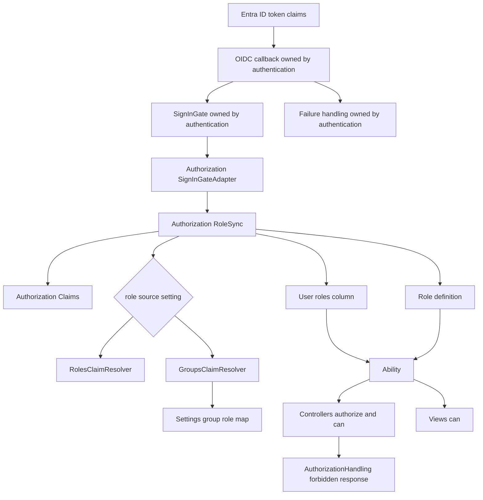
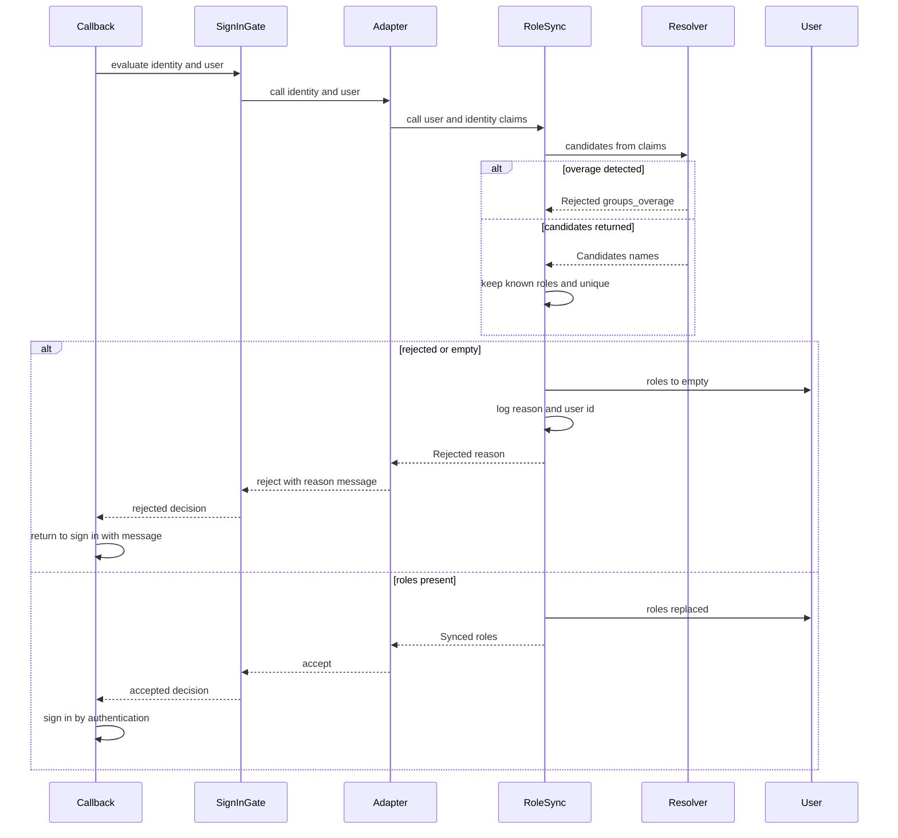

# Design Document

## Overview
本機能は、Entra ID で管理されたロール・グループの割り当てをアプリ内ロールとして取り込み、ログインのたびに `User` へ保存し、ロールに基づいて画面と操作の可否を判定できるようにする。

**Purpose**: Entra ID でログインできる人を、ロールごとの権限で出し分け・拒否できる状態にする。
**Users**: 開発チーム（ロール定義・権限定義・方式選択）、運用者（Entra ID 設定・拒否ログの確認）、利用者（ログイン拒否理由の確認、権限なしの通知）。
**Impact**: `entra-authentication` が提供するサインイン可否ゲートにアダプタを 1 か所登録して「ロール同期」を接続し、`User` にロール配列を追加し、`ApplicationController` に権限なしの共通処理を加える。

### Goals
- roles クレーム方式 / groups クレーム方式を、設定で切り替えられる 1 つのインターフェースの背後に置く（3, 4, 5）
- 共通規則（既知ロールのみ・重複なし・空なら拒否）を 1 か所で適用する（2, 5.4, 6）
- ロール空・overage を区別して拒否し、理由の表示と記録を行う（6, 7, 8）
- cancancan の `Ability` でロールごとの権限を定義し、コントローラとビューで判定できる（9, 10）

### Non-Goals
- ログイン・セッション・ログアウトの基盤、`User` の同定（`entra-authentication`）
- Graph API による overage 解決、ロールの DB 管理、管理画面
- 業務リソースごとの詳細な権限設計、`check_authorization` による認可漏れの強制
- Entra ID テナントの設定作業そのもの（手順の文書化のみ）

## Boundary Commitments

### This Spec Owns
- ロール名の定義（`Role`）と、`User` のロール配列（`users.roles`）の内容と更新
- クレームからロールを導出する 2 方式と、その共通規則、方式の選択と起動時検証
- ロール空 / overage による拒否の判定結果（`Rejected`）と、その理由メッセージ・ログ記録
- `Ability`（ロール → 権限）と、権限なし（`CanCan::AccessDenied`）の共通応答
- Entra ID 側設定手順のドキュメント（`docs/entra-authorization.md`）

### Out of Boundary
- OmniAuth / Devise の設定、`User` の作成・同定（`oid` + `tid`）、`sign_in` の実行、セッション寿命、ログアウト
- 拒否後にログイン画面へ戻す処理と失敗メッセージ表示の仕組み（authentication の失敗ハンドリング。本 spec は表示するメッセージの文言と理由を渡す）
- 未ログイン時のログイン導線（authentication の認証必須化）
- 業務リソースごとの権限（`Ability` への追記はドメイン機能側の spec が行う）

### Allowed Dependencies
- Upstream: `entra-authentication` が提供する `User` モデル、サインイン可否ゲート（`EntraAuth::SignInGate`）、`current_user`、失敗ハンドリング。ゲートの契約: `register(callable)`、callable は `(identity, user) -> Decision`、ゲートは自分の変更を受理・拒否のどちらでも自分で保存する、拒否の `message` は利用者にそのまま表示される、例外は `:gate_error` の拒否になる
- gem: cancancan 3.6.x、config 5.6.x
- ID token クレーム（`auth.extra.raw_info` のうち `roles` / `groups` / `_claim_names` / `_claim_sources` の 4 キーのみ）
- 依存方向: `Role` ← `Authorization::*`（Claims / Resolvers / RoleSync）← callback。`Ability` は `Role` のみに依存し、`Authorization::*` に依存しない。`Authorization::*` は `Ability` とコントローラに依存しない

### Revalidation Triggers
- `Authorization::RoleSync.call` の引数・戻り値の形の変更（authentication の callback が再確認）
- `Rejected#reason` の値の追加・変更、メッセージ I18n キーの変更（authentication の失敗ハンドリング・ログイン画面が再確認）
- `users.roles` の型や意味（ロール名の配列）の変更（ドメイン機能・`Ability` が再確認）
- `Role::NAMES` からのロール削除・改名（Entra ID の App Role 値・マッピング設定・`Ability` が再確認）
- 方式の設定キー（`Settings.authorization.*`）の変更（運用手順・デプロイ設定が再確認）

## Architecture

### Existing Architecture Analysis
`rails new` 直後で認証は未実装。`entra-authentication` は実装済みで、サインイン可否ゲート（`EntraAuth::SignInGate`）が拡張点として提供されている。本 spec はこのゲートに合わせて接続する（当初は callback への 1 行呼び出しを想定していたが、ゲートの登録に置き換えた）。`structure.md` に従い、独自の層は作らず `app/models`（PORO を含む）、`app/controllers/concerns`、`config/initializers` に置く。

### Architecture Pattern & Boundary Map



**Architecture Integration**:
- Selected pattern: PORO の resolver 2 種 + 共通規則を持つ `RoleSync`（research.md「Architecture Pattern Evaluation」B）
- Domain/feature boundaries: 「クレーム → ロール（RoleSync 系）」と「ロール → 権限（Ability 系）」は `Role` と `users.roles` だけで接続し、相互に依存しない
- Existing patterns preserved: Rails 標準の置き場所、薄いコントローラ（concern）、Zeitwerk
- New components rationale: 方式差を resolver に閉じ込め、共通規則を 1 か所に置くため
- Steering compliance: 独自ディレクトリ層を作らない（`app/services` なし）。秘密情報は扱わない（設定は非秘密の GUID とロール名のみ）

### Technology Stack

| Layer | Choice / Version | Role in Feature | Notes |
|-------|------------------|-----------------|-------|
| Backend / Services | Rails 7.2 / Ruby 4.0（既存） | PORO、concern、initializer | `Data.define` を結果型に使う |
| Backend / Authorization | cancancan 3.6.x（新規） | `Ability`、`authorize!`、`can?`、`CanCan::AccessDenied` | 3.6.1 のソースで API を確認済み |
| Backend / Config | config 5.6.x（新規） | 方式とグループ → ロールのマッピングを `Settings` で提供 | ENV 上書きは無効（既定） |
| Data / Storage | `users.roles` JSON カラム | ロール名の配列 | SQLite / PostgreSQL 両対応（DB 未確定のため） |
| Infrastructure / Runtime | 設定ファイル `config/settings*.yml` | 環境ごとの方式・マッピング | `settings.local.yml` は gitignore |

## File Structure Plan

### Directory Structure
```
app/
├── models/
│   ├── role.rb                                   # ロール名の定義と既知ロールでの絞り込み
│   ├── ability.rb                                # ロール → 権限（cancancan Ability）
│   └── authorization/
│       ├── claims.rb                             # raw_info から 4 キーだけを取り出す値オブジェクト（inspect は伏せる）
│       ├── role_sync.rb                          # 解決 → 共通規則 → 保存 / 拒否 → 記録。ロール導出の唯一の入口
│       ├── sign_in_gate_adapter.rb               # SignInGate の callable。RoleSync の結果を Decision に変換する薄いアダプタ
│       ├── result.rb                             # Synced / Rejected / Candidates の結果型
│       ├── role_source.rb                        # role_source / group_role_map の読み取り・検証（起動時検証と RoleSync が共用）
│       └── resolvers/
│           ├── roles_claim_resolver.rb           # roles クレーム方式の候補抽出
│           └── groups_claim_resolver.rb          # groups クレーム方式の候補抽出と overage 検知
├── controllers/concerns/
│   └── authorization_handling.rb                 # AccessDenied の共通応答
└── views/errors/
    └── forbidden.html.erb                        # 権限なし画面（ロールや権限定義の内部情報を出さない）
config/
├── initializers/
│   ├── config.rb                                 # config gem の初期化（generator 生成）
│   └── authorization.rb                          # 方式・マッピングの起動時検証（config.after_initialize 内）と、SignInGate へのアダプタ登録（呼び出しは遅延評価）
├── settings.yml                                  # group_role_map の既定（role_source は既定値を置かない）
├── settings/{development,test,production}.yml    # 環境別の上書き。role_source は各環境で明示する
└── locales/authorization.{en,ja}.yml             # 拒否理由と権限なしのメッセージ
db/migrate/
└── <timestamp>_add_roles_to_users.rb             # users.roles（JSON 配列、null 不可、既定 []）
docs/
└── entra-authorization.md                        # Entra ID 側設定手順・方式選択・事前確認・制約
test/
├── models/{role,ability}_test.rb
├── models/authorization/{claims,role_sync}_test.rb
├── models/authorization/resolvers/{roles_claim,groups_claim}_resolver_test.rb
├── controllers/authorization_handling_test.rb
└── integration/role_login_rejection_test.rb
```

### Modified Files
- `Gemfile` / `Gemfile.lock` — `cancancan ~> 3.6`、`config ~> 5.6` を追加
- `app/controllers/application_controller.rb` — `AuthorizationHandling` を include
- `app/models/user.rb`（authentication が作成）— 変更なし。`roles` は列として利用するのみ
- authentication のコードは変更しない。接続は `config/initializers/authorization.rb` での `EntraAuth::SignInGate.register` のみ（authentication の Implementation Notes「SignInGate（2.5）」に従う）
- `.gitignore` — `config/settings.local.yml`、`config/settings/*.local.yml` を追加

## System Flows



**Flow-level decisions**:
- `sign_in` はゲートが受理した後にのみ行われる（authentication の callback の既存の挙動）。これにより 6.1, 7.1 の「ログイン済みにしない」が成立する。ゲートは `User` の特定・作成の後、`sign_in` の前に評価される
- 拒否時は保存済みロールを空にする。他ブラウザに旧セッションが残っても `Ability` が全操作を拒否する（6.3, 7.3, 9.6）

## Requirements Traceability

| Requirement | Summary | Components | Interfaces | Flows |
|-------------|---------|------------|------------|-------|
| 1.1 | ロール名をコードで定義 | Role | `Role::NAMES` | - |
| 1.2 | 利用者ごとにロール配列を保持 | users.roles | JSON 配列 | - |
| 1.3 | DB のロール管理が不要 | Role, users.roles | 定数 + 配列のみ | - |
| 1.4 | 既存利用者へロール空で導入 | Migration | `default: []`, `null: false` | - |
| 2.1 | ログインごとにロールを置換 | RoleSync | `RoleSync.call` | ログイン時ロール同期 |
| 2.2 | 割り当て変更後の再ログインで反映 | RoleSync | 置換の意味（差分でなく全置換） | 同上 |
| 2.3 | 未定義ロールを除外 | Role, RoleSync | `Role.known` | 同上 |
| 2.4 | 重複なし | Role, RoleSync | `Role.known`（uniq） | 同上 |
| 2.5 | 次回ログインまで不変 | RoleSync | 書き込み経路が RoleSync のみ | - |
| 3.1 | roles 値のうち定義済みを採用 | RolesClaimResolver, Claims | `#call(claims)` | 同上 |
| 3.2 | roles なしは空 | RolesClaimResolver | 空の `Candidates` | 同上 |
| 3.3 | 未定義値のみは空 | RolesClaimResolver, Role | `Role.known` 後に空 | 同上 |
| 3.4 | groups をロール導出に使わない | RolesClaimResolver | `roles` キーのみ参照 | - |
| 4.1 | GUID → ロール名の設定 | Settings, config/settings.yml | `Settings.authorization.group_role_map` | - |
| 4.2 | 対応表にある GUID のロールを採用 | GroupsClaimResolver | `#call(claims)` | 同上 |
| 4.3 | 対応表にないグループは無視 | GroupsClaimResolver | 対応表の照合のみ | - |
| 4.4 | 未定義ロール名を参照するマッピングは不採用 | Role, initializer | `Role.known`、起動時警告 | - |
| 4.5 | groups も overage もなければ空 | GroupsClaimResolver | 空の `Candidates` | - |
| 4.6 | roles をロール導出に使わない | GroupsClaimResolver | `groups` / `_claim_names` のみ参照 | - |
| 5.1 | 設定で 1 方式を選ぶ | RoleSync | `Settings.authorization.role_source` | - |
| 5.2 | 未指定は起動時エラー | authorization initializer | 起動時検証 | - |
| 5.3 | 未対応値は起動時エラー | authorization initializer | 起動時検証 | - |
| 5.4 | 方式によらず同一規則 | RoleSync | 共通規則の 1 か所適用 | 同上 |
| 6.1 | ロール空でログイン拒否 | RoleSync, callback | `Rejected(:no_roles)` | 同上 |
| 6.2 | 未割り当ての理由を表示 | I18n, failure handling | `authorization.rejections.no_roles` | 同上 |
| 6.3 | 旧ロールを使わない | RoleSync | 拒否時に `roles = []` | 同上 |
| 6.4 | 全取り消し後の再ログインを拒否 | RoleSync | 2.1 と 6.1 の組み合わせ | 同上 |
| 7.1 | overage でログイン拒否 | GroupsClaimResolver, RoleSync | `Rejected(:groups_overage)` | 同上 |
| 7.2 | overage の理由を表示 | I18n, failure handling | `authorization.rejections.groups_overage` | 同上 |
| 7.3 | 旧ロールを使わない | RoleSync | 拒否時に `roles = []` | 同上 |
| 7.4 | 外部 API を呼ばない | GroupsClaimResolver | ネットワーク呼び出しを持たない | - |
| 7.5 | roles 方式では overage 拒否をしない | RoleSync | 方式に応じた resolver のみ実行 | - |
| 8.1 | 理由を区別して表示 | I18n | 理由ごとの別キー | 同上 |
| 8.2 | クレームの生の内容・GUID を出さない | I18n, Claims | 固定文言のみ、`Claims#inspect` を伏せる | - |
| 8.3 | 再試行できる画面へ | failure handling（authentication） | 期待として契約に記載 | 同上 |
| 8.4 | 拒否理由を記録 | RoleSync | `Rails.logger.warn` | 同上 |
| 9.1 | ロールごとの権限を 1 か所で定義 | Ability | `Ability#initialize` | - |
| 9.2 | 複数ロールは和集合 | Ability | ロールごとの定義を全て適用 | - |
| 9.3 | コントローラで判定 | Ability, cancancan | `authorize!` | - |
| 9.4 | ビューで判定 | Ability, cancancan | `can?` | - |
| 9.5 | 未許可の操作は実行せず権限なしを返す | AuthorizationHandling | `rescue_from CanCan::AccessDenied` | - |
| 9.6 | ロールなしは全操作を拒否 | Ability | 空ロール = 権限定義なし | - |
| 9.7 | 単純に保つ | Ability | ロールごとのメソッド直書き | - |
| 10.1 | 権限なし画面を返す | AuthorizationHandling, forbidden view | 403 | - |
| 10.2 | 副作用を発生させない | cancancan | `authorize!` を操作の前に置く規約 | - |
| 10.3 | 内部情報を含めない | forbidden view | 固定文言のみ | - |
| 10.4 | 未ログインはログイン導線へ | AuthorizationHandling | 未ログインなら `authenticate_user!` へ委譲 | - |
| 11.1 | roles 方式の Entra ID 側前提を文書化 | Setup guide | docs/entra-authorization.md | - |
| 11.2 | groups 方式の Entra ID 側前提を文書化 | Setup guide | docs/entra-authorization.md | - |
| 11.3 | groups 方式の制約（overage 上限・事前確認）を文書化 | Setup guide | docs/entra-authorization.md | - |
| 11.4 | roles 方式ではグループ階層が反映されないことを文書化 | Setup guide | docs/entra-authorization.md | - |
| 11.5 | 方式選択の判断基準（テナント契約種別）を文書化 | Setup guide | docs/entra-authorization.md | - |
| 11.6 | ロール反映がログイン時のみであることと遅延上限を文書化 | Setup guide | docs/entra-authorization.md | - |
| 12.1 | groups の全内容を出力しない | RoleSync, Claims | ログは理由と user id のみ | - |
| 12.2 | 保存は定義済みロール名のみ | RoleSync | `Role.known` 後のみ保存 | - |
| 12.3 | 署名検証済みクレームのみ使用 | Claims | 4 キーのみ読む（research.md 参照） | - |

## Components and Interfaces

| Component | Domain/Layer | Intent | Req Coverage | Key Dependencies | Contracts |
|-----------|--------------|--------|--------------|------------------|-----------|
| Role | Model | ロール名の定義と絞り込み | 1.1, 1.3, 2.3, 2.4, 3.3, 4.4 | なし | Service |
| Authorization::Claims | Model | raw_info から権限判断用の 4 キーだけを取り出す | 8.2, 12.1, 12.3 | raw_info (P0) | Service |
| Resolvers (2) | Model | 方式ごとの候補ロール名の抽出と overage 検知 | 3.1-3.4, 4.1-4.6, 7.1, 7.4 | Claims (P0), Settings (P0, groups のみ) | Service |
| Authorization::SignInGateAdapter | Model | ゲートと RoleSync の接続 | 2.1, 6.1, 6.2, 7.1, 7.2, 8.1, 8.3 | SignInGate (P0), RoleSync (P0), I18n (P0) | Service |
| Authorization::RoleSync | Model | 共通規則の適用、保存 / 拒否、記録 | 2.1-2.5, 5.1, 5.4, 6.1, 6.3, 6.4, 7.1, 7.3, 7.5, 8.4, 12.1, 12.2 | Role (P0), Resolvers (P0), User (P0) | Service |
| Authorization initializer | Config | 方式と設定の起動時検証 | 4.1, 4.4, 5.2, 5.3 | Settings (P0), Role (P0) | State |
| Ability | Model | ロール → 権限 | 9.1, 9.2, 9.6, 9.7 | Role (P0), cancancan (P0) | Service |
| AuthorizationHandling | Controller concern | 権限なしの共通応答 | 9.5, 10.1-10.4 | cancancan (P0), Devise (P0, authentication) | Service |
| Rejection messages | I18n | 拒否理由・権限なしの文言 | 6.2, 7.2, 8.1, 8.2, 10.3 | なし | State |
| users.roles + migration | Data | ロール配列の保持 | 1.2, 1.4 | User (P0) | State |
| Setup guide | Docs | Entra ID 側手順 | 11.1-11.6 | なし | - |

### Model Layer

#### Role

| Field | Detail |
|-------|--------|
| Intent | アプリ内で有効なロール名の唯一の定義 |
| Requirements | 1.1, 1.3, 2.3, 2.4, 3.3, 4.4 |

**Responsibilities & Constraints**
- `NAMES` に有効なロール名の一覧を持つ。データベースには持たない
- 未定義名の除外と重複排除は `known` のみが行う（他所で再実装しない）

**Contracts**: Service [x]

```ruby
module Role
  NAMES: Array[String]  # frozen。初期値は open question 参照
  def self.known(names: Array[String]) -> Array[String]  # NAMES に含まれるものだけ、重複なし、NAMES の順
end
```
- Preconditions: `names` は文字列の配列（それ以外の要素は無視する）
- Postconditions: 戻り値は `NAMES` の部分集合で重複がない
- Invariants: `NAMES` の各要素は Entra ID の App Role 値およびマッピングのロール名と完全一致する

#### Authorization::Claims

| Field | Detail |
|-------|--------|
| Intent | `auth.extra.raw_info` から `roles` / `groups` / `_claim_names`（overage 判定）だけを型検査して取り出す。`_claim_sources` は使わず保持しない |
| Requirements | 8.2, 12.1, 12.3 |

**Responsibilities & Constraints**
- `roles` / `groups` の文字列配列と overage の真偽値以外は保持しない（userinfo 由来の属性を権限判断に使わない）
- 型が想定と異なる値（`roles` が配列でない等）は空として扱う
- `inspect` / `to_s` は内容を伏せる（ログへの混入防止）

**Contracts**: Service [x]

```ruby
module Authorization
  class Claims
    def self.from_raw_info(raw_info: Hash[String, untyped]) -> Claims
    def roles -> Array[String]
    def groups -> Array[String]
    def groups_overage? -> bool  # _claim_names がハッシュで "groups" キーを持つ
  end
end
```

#### Authorization::Resolvers

| Field | Detail |
|-------|--------|
| Intent | 方式ごとに「候補ロール名」を返す。共通規則は適用しない |
| Requirements | 3.1-3.4, 4.1-4.6, 7.1, 7.4 |

**Contracts**: Service [x]

```ruby
module Authorization
  module Resolvers
    class RolesClaimResolver
      def call(claims: Claims) -> Candidates          # roles クレームの値をそのまま候補にする
    end
    class GroupsClaimResolver
      def initialize(group_role_map: Hash[String, String])  # キーは小文字の GUID
      def call(claims: Claims) -> Candidates | Rejected     # overage なら Rejected(:groups_overage)
    end
  end
end
```
- GroupsClaimResolver は overage 判定を groups の有無より先に行い、外部呼び出しをしない（7.4）
- GUID の照合は大文字小文字を区別しない（対応表のキーも `groups` の値も小文字化して比較）
- RolesClaimResolver は `groups` を、GroupsClaimResolver は `roles` を参照しない（3.4, 4.6）

#### Authorization::RoleSync

| Field | Detail |
|-------|--------|
| Intent | callback から呼ばれる唯一の入口。ロールを導出し、共通規則を適用し、保存または拒否する |
| Requirements | 2.1-2.5, 5.1, 5.4, 6.1, 6.3, 6.4, 7.1, 7.3, 7.5, 8.4, 12.1, 12.2 |

**Responsibilities & Constraints**
- `users.roles` の書き込みはこのクラスのみが行う（2.5）
- 共通規則: `Role.known` → 空なら `Rejected(:no_roles)`。全ての方式で同一（5.4）
- 拒否時は既存 `User` のロールを `[]` に更新し（`persisted?` のとき）、`Rails.logger.warn` に理由と `user.id` だけを出す（8.4, 12.1）。クレームの内容は出さない
- `sign_in` を行わない。呼び出し側が結果に従う

**Dependencies**
- Inbound: SignInGateAdapter — ログイン処理中の唯一の呼び出し (P0)
- Outbound: Role, Claims, Resolvers, User (P0)
- External: `Settings.authorization.*` (P0)

**Contracts**: Service [x]

```ruby
module Authorization
  module Result
    REASONS  = %i[no_roles groups_overage].freeze
    Candidates = Data.define(:names)   # names: Array[String]
    Synced     = Data.define(:roles)   # roles: Array[String]（保存済み、非空。空は ArgumentError）
    Rejected   = Data.define(:reason)  # reason: REASONS のいずれか（他は ArgumentError）
  end

  module RoleSync
    def self.call(user: User, raw_info: Hash[String, untyped]) -> Synced | Rejected
  end
end
```
- Preconditions: `user` は authentication が特定・作成済みで、`sign_in` は未実行。`raw_info` は検証済み ID token のクレーム（authentication では `identity.claims`）
- Postconditions: `Synced` のとき `user.roles == roles` かつ `roles` は非空で `Role::NAMES` の部分集合。`Rejected` のとき `user.roles == []`（`user` が保存済みの場合）
- Invariants: 同じ入力から常に同じ結果になる（外部状態は `Settings` のみ）

**Implementation Notes**
- Integration: `reason` から I18n キー `authorization.rejections.<reason>` の文言を作り、アダプタが `SignInGate.reject` に渡す。ログイン画面へ戻す遷移（8.3）は authentication の callback が行う（拒否時はセッションなしでログイン画面へ 303）
- Validation: 方式は `Settings.authorization.role_source`（`"roles"` / `"groups"`）で選ぶ。起動時に検証済みのため、実行時に未知の値は来ない
- Risks: 一時的な設定誤りで全員が拒否される。起動時の警告と手順書の事前確認で緩和する

#### Authorization::SignInGateAdapter

| Field | Detail |
|-------|--------|
| Intent | authentication のサインイン可否ゲートと RoleSync を接続する |
| Requirements | 2.1, 6.1, 6.2, 7.1, 7.2, 8.1, 8.3 |

**Responsibilities & Constraints**
- `call(identity, user)` で `RoleSync.call(user:, raw_info: identity.claims)` を呼ぶ。人の同定には触れない（`identity.claims` は `roles` / `groups` などの読み取りにのみ使う）
- `Synced` なら `SignInGate.accept`、`Rejected` なら `SignInGate.reject(reason:, message: I18n.t("authorization.rejections.<reason>"))`
- 保存は `RoleSync` が受理・拒否のどちらでも行う（ゲートの契約）。メッセージは固定文言のみ（クレームや GUID を含めない）
- 登録は `config/initializers/authorization.rb` で 1 回。呼び出しは遅延評価（リロード対象の定数を起動時に参照しない）。テストは各テストの前後でゲートが `reset!` されるため、必要なテストで再登録する

**Contracts**: Service [x]
```ruby
module Authorization
  module SignInGateAdapter
    def self.call(identity: EntraAuth::VerifiedIdentity, user: User) -> EntraAuth::SignInGate::Decision
  end
end
```

#### Ability

| Field | Detail |
|-------|--------|
| Intent | ロールごとの権限を 1 か所で定義する |
| Requirements | 9.1, 9.2, 9.6, 9.7 |

**Responsibilities & Constraints**
- `user` が `nil` またはロールなしのとき、何も許可しない（9.6）
- 保存値は再度 `Role.known` で絞ってから権限を適用する（コードから消えたロールが DB に残っていても効かない）
- ロールごとに 1 メソッド（例: `admin_rules`）とし、複数ロールは全て適用する（cancancan の加算的な `can` により和集合、9.2）
- 業務リソースごとの権限は含めない。最初のドメイン機能が追記する（9.7）

**Contracts**: Service [x]
```ruby
class Ability
  include CanCan::Ability
  def initialize(user: User | nil) -> void
end
```

### Controller Layer

#### AuthorizationHandling

| Field | Detail |
|-------|--------|
| Intent | `CanCan::AccessDenied` の共通応答 |
| Requirements | 9.5, 10.1, 10.2, 10.3, 10.4 |

**Responsibilities & Constraints**
- `rescue_from CanCan::AccessDenied` で、HTML には `errors/forbidden` を 403 で描画し、その他の形式は `head :forbidden` を返す
- 未ログイン（`user_signed_in?` が偽）の場合は 403 ではなく `authenticate_user!` に委譲する（10.4）
- 応答にロール名・権限定義・例外メッセージを含めない（10.3）
- 副作用の防止は「`authorize!` を操作の前に置く」規約で担保する。ハンドラは副作用を起こさない（10.2）

**Contracts**: Service [x]
```ruby
module AuthorizationHandling
  extend ActiveSupport::Concern
  # included: rescue_from CanCan::AccessDenied, with: :render_forbidden
  private def render_forbidden(exception: CanCan::AccessDenied) -> void
end
```

### Config / Data Layer

#### Authorization initializer と設定

`config/settings.yml` の契約:

```yaml
# config/settings.yml（role_source は既定値を置かない）
authorization:
  group_role_map: {}        # groups 方式のみ。<グループ Object ID>: <ロール名>

# config/settings/<env>.yml（各環境で明示する）
authorization:
  role_source: roles        # roles | groups（必須）
```

- `role_source` に既定値を置かない。既定値があると 5.2（未指定は起動時エラー）が成立せず、Free テナントで `roles` が黙って選ばれて全員が拒否される
- 検証は `Rails.application.config.after_initialize` 内で行う。`config/initializers/` の読み込み時点では `Role` など `app/` 配下の定数を参照できない（Rails 7.2 で `NameError` になることを確認済み）
- 起動時に検証する: `role_source` が未指定・未対応値ならエラーで停止（5.2, 5.3）。`groups` のとき `group_role_map` の値が `Role::NAMES` に無ければ警告を出す（4.4）。マッピングが空の `groups` 方式は警告する
- GUID キーは文字列化・小文字化して `GroupsClaimResolver` に渡す

#### users.roles（マイグレーション）

- `add_column :users, :roles, :json, null: false, default: []`
- 既存行は空配列で導入される（1.4）。`entra-authentication` の `users` 作成マイグレーションの後に実行する（別ファイル）

## Data Models

### Logical Data Model
- `User` 1 件につき `roles`: 文字列の配列（0 個以上）。要素は `Role::NAMES` のいずれか（書き込み時に保証。読み出し時は `Ability` が再度絞る）
- 一意性・関連なし。インデックスなし（ロールで検索する要件がない）
- 整合性: 書き込みは `RoleSync` のみ。同時ログインは後勝ち（許容）

### Data Contracts & Integration
- 入力: `auth.extra.raw_info` の `roles: Array[String]`、`groups: Array[String]`、`_claim_names: Hash`、`_claim_sources: Hash`
- 出力: `Synced(roles)` / `Rejected(reason)`。`reason` の値: `:no_roles`, `:groups_overage`

## Error Handling

### Error Strategy
- **拒否（ロール空 / overage）**: 例外にせず `Rejected` を返す。呼び出し側が失敗ハンドリングに渡す。WARN ログは理由と `user.id` のみ
- **権限なし**: `CanCan::AccessDenied` を `AuthorizationHandling` が 403 に変換する
- **設定不備**: 起動時に例外で停止する（5.2, 5.3）。実行時に設定不備を検出して黙って続行しない
- **想定外のクレーム型**: `Claims` が空として扱う。結果としてロール空の拒否になる（安全側）

### Monitoring
- 拒否のたびに `[authorization] login rejected reason=<reason> user_id=<id>` を WARN で出力する。運用者は理由別の件数を確認できる

## Testing Strategy

### Unit Tests
- `Role.known`: 未定義名の除去、重複排除、非文字列要素の無視（2.3, 2.4）
- `Claims`: 4 キー以外を保持しない、型不正は空、`groups_overage?` が `_claim_names.groups` で真になる、`inspect` にクレーム内容が出ない（7.1, 8.2, 12.3）
- `RolesClaimResolver`: 定義済み値のみ / roles なし / 未定義値のみ / `groups` があっても無視（3.1-3.4）
- `GroupsClaimResolver`: 対応表ヒット / 未登録グループ無視 / GUID の大文字小文字差 / overage 優先 / `roles` を無視（4.2-4.6, 7.1）
- `Ability`: 単一ロール / 複数ロールの和集合 / ロール空・`nil` は全拒否 / DB に残った未定義ロールは無効（9.2, 9.6）

### Integration Tests
- `RoleSync`（roles 方式）: 保存済みロールが新しい割り当てに置換される。全取り消しで `Rejected(:no_roles)` かつ `user.roles == []`（2.1, 2.2, 6.3, 6.4）
- `RoleSync`（groups 方式）: overage で `Rejected(:groups_overage)` かつ旧ロールが消える。roles 方式では overage 相当のクレームがあっても拒否しない（7.1, 7.3, 7.5）
- 2 方式で同じ規則が働くこと: 未定義ロールのみ → どちらも `no_roles`（5.4）
- 起動時検証: `role_source` の未指定・未知の値で例外、未定義ロールのマッピングで警告（4.4, 5.2, 5.3）
- 権限なしの応答: ログイン済み・無権限で 403 と `forbidden` 画面、ロール名を含まない、副作用なし。未ログインはログイン導線へ（9.5, 10.1-10.4）
- マイグレーション: SQLite と PostgreSQL の両方で `roles` の既定値と読み書きが動く（1.2, 1.4）

### E2E/UI Tests
- ロールなしユーザーの OIDC ログイン（テスト用にコールバックをモック）でログイン画面に戻り、`no_roles` の文言が出て、ログイン済みにならない（6.1, 6.2, 8.3）
- overage のログインで `groups_overage` の文言が出て、`no_roles` と区別できる（7.2, 8.1）
- `can?` によるビューの出し分け（許可 / 不許可でリンクの表示が切り替わる）（9.4）

## Security Considerations
- 権限判断に使うクレームは `roles` / `groups` / `_claim_names` / `_claim_sources` に限定する。`raw_info` は userinfo と ID token の合成だが、これらのキーは userinfo に含まれず、同名でも ID token が優先されるため、署名検証済みクレームのみが効く（12.3、research.md）
- ログ・画面にクレームの生の内容や GUID を出さない（8.2, 12.1）
- 設定に含まれるのは GUID とロール名のみで、秘密情報ではない。秘密情報は authentication が扱う
- ロール変更の反映遅延は、authentication のセッション絶対上限に依存する（11.6 で文書化）

## Open Questions / Risks
- **初期ロール名**: `Role::NAMES` の具体値は要件にない。実装時は仮に `admin` と `member` の 2 つで作成し、ドメイン機能の spec で確定する
- **authentication との契約（解決済み）**: authentication の実装が `SignInGate`（`register` / `evaluate` / `Decision`）を提供した。本 spec はアダプタを登録して接続する。ゲートの契約が変わる場合は Revalidation Triggers に従い再確認する
- **既定ロケール**: アプリの既定ロケールは未設定（`en`）。拒否理由は `en` / `ja` の両方を用意する。表示言語の決定は本 spec の対象外
- **`check_authorization` の強制**: 最初のドメイン機能の spec で判断する（research.md）
